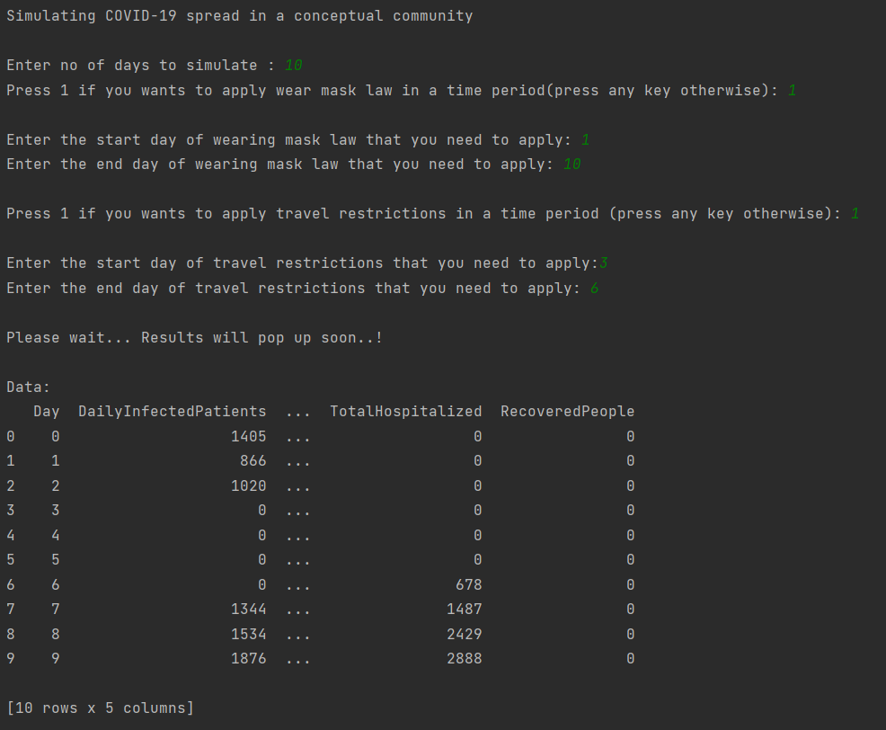
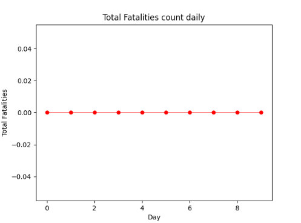
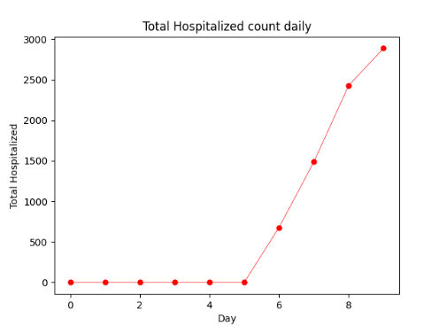
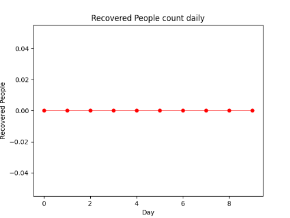
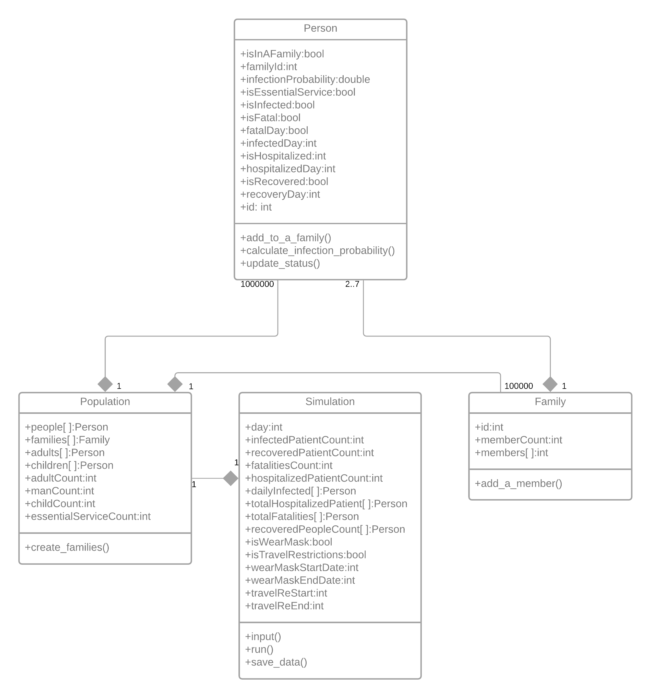

<h1 align="center">
   
  Virus Spread Simulation by using large data set in python
   
</h1>

<h4 align="center">This project developed to analyze the spread of the COVID-19 virus in a conceptual community with a population of one million.</h4>

  
  
  
   
  <a href="#description">Description</a> *
  <a href="#functionalities">Functionalities</a> *
  <a href="#other-assumptions">Other-Assumptions</a> *
  <a href="#output">Output</a> 

## Description

- These characteristics can be seen in the population: In the neighborhood, there are about 100,000 families, and a family might consist of two to seven people. Seniors above the age of 65 make up more than 30% of the population. Children under the age of 18 make up 20% of the population. It is estimated that 40.000 persons work in the nation's essential services.
- For children, adults, and senior citizens, the odds of contracting the virus are 10–20%, 15–40%, and 35–60%, respectively. Face masks, however, reduce the population's overall risk of infection to 5–10%. In the interim, it is assumed that, should one member of the family contract the disease, the other members will have a 40 to 80% risk of contracting it as well.
- After the fifth day, the infection's symptoms become apparent. After the 11th day of infection, a patient with the virus cannot transmit it to others. A patient is hospitalized for 10 days after being found to have COVID-19. We will suppose that the infection has a mortality rate of 0.1%. The gender has no bearing on the virus. Those who contract the disease develop immunity for 6 to 7 months.

## Functionalities

- Simulates the daily spread of the virus throughout the population if just one person contracts COVID-19 on day one. In the simulation, the user has the power to enforce travel limitations and the requirement to wear a face mask at any time, as well as to lift the enforcement.
- Shows the number of infected individuals on a daily basis, the number of hospitalized patients overall, the number of fatalities overall, and the number of those who have recovered for at least 50 days (by default can simulate for any number of days).

## Output

## Other Assumptions

- Except for those who work in critical services, there is a 15–25% reduction in infection risk when travel restrictions are in place.
- The likelihood of infection rises as there are more infected people in the population.
- Every family contains at least one senior or adult.
- A person who has been identified as a Covid patient has a 50% chance of being admitted to a hospital on any given day.
- If a person does not pass away 15 days after contracting the infection, they are recovered.
